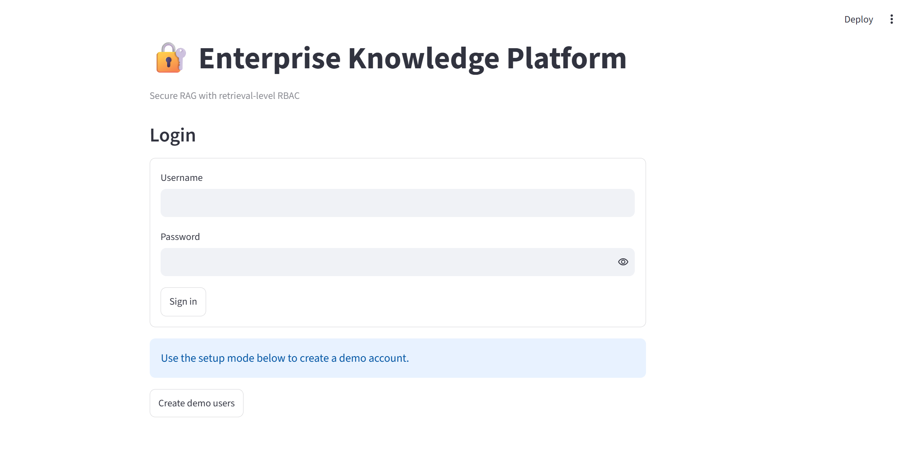
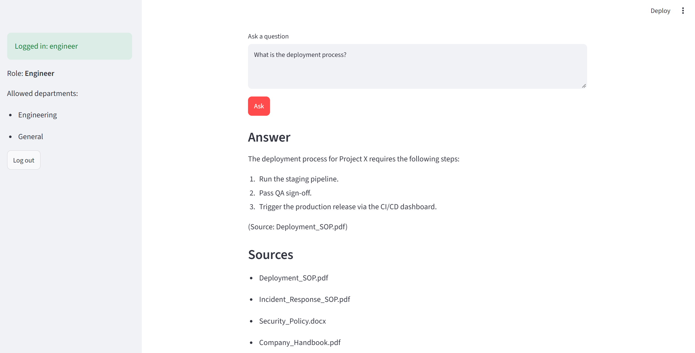
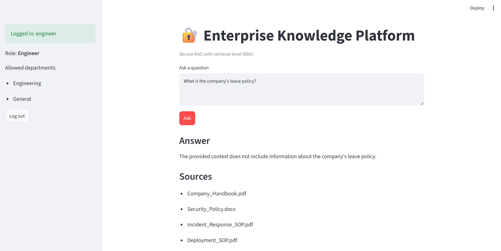

# Enterprise Knowledge Platform — RAG with RBAC 
 
## Brief One-Line Summary 
 
A secure enterprise RAG platform that answers employee questions from company documents while enforcing role-based access control (RBAC) at the retrieval level. 
 
## Overview 
 
This project builds an enterprise question-answering system using Retrieval-Augmented Generation (RAG). Instead of relying only on the LLM's knowledge, the system retrieves relevant information from internal company documents and uses that context to generate grounded answers. 
 
A key feature of the platform is retrieval-level Role-Based Access Control (RBAC). Each user is assigned a role, and the system maps that role to the departments they are allowed to access. Documents are tagged with department metadata during ingestion, and unauthorized documents are filtered out during retrieval before the retrieved context is sent to the LLM. 
 
The application is deployed as an interactive Streamlit web application with authentication, source citations, and audit logging. 
 
## Demo 
 
### App Interface 
 
 
 
### RAG Question Answering 
 
 
 
### Role-Based Access Control 
 
 
 
## Problem Statement 
 
Traditional enterprise chatbots can expose sensitive information if access control is implemented only at the application or response level. 
 
For example, an Engineer should be able to access Engineering documents but should not be able to retrieve HR documents. 
 
This project addresses the problem by enforcing access permissions during the retrieval stage itself. Only document chunks belonging to departments permitted for the logged-in user's role are retrieved and passed to the LLM. 
 
## Data Sources 
 
The system uses a set of sample enterprise documents organized by department: 
 
- **Engineering** — Deployment SOP, Incident Response SOP, Security Policy 
- **HR** — Compensation Policy, Leave Policy 
- **General** — Company Handbook 
 
Supported document formats: 
 
- PDF 
- DOCX 
- TXT 
 
## Tools and Technologies 
 
**Language:** Python 
 
**Frameworks:** LangChain, Streamlit 
 
**Vector Store:** ChromaDB 
 
**Embeddings:** OpenAI `text-embedding-3-small` 
 
**LLM:** OpenAI `gpt-4o-mini` 
 
**Authentication:** SQLite, bcrypt 
 
**Evaluation:** Recall@K, Access-Control Accuracy, LLM-based Faithfulness 
 
**Development:** VS Code 
 
## Project Structure 
 
    enterprise-knowledge-platform/ 
    │ 
    ├── app.py                  # Streamlit application and user interface 
    ├── auth.py                 # Authentication and role-permission mapping 
    ├── rag.py                  # Document ingestion, retrieval, generation and audit logging 
    ├── evaluation.py           # Offline evaluation pipeline and metrics 
    ├── requirements.txt        # Python dependencies 
    ├── test_questions.csv      # Evaluation questions and expected results 
    │ 
    ├── company_docs/ 
    │   ├── Engineering/ 
    │   │   ├── Deployment_SOP.pdf 
    │   │   ├── Incident_Response_SOP.pdf 
    │   │   └── Security_Policy.docx 
    │   │ 
    │   ├── HR/ 
    │   │   ├── HR_Compensation_Policy.pdf 
    │   │   └── HR_Leave_Policy.pdf 
    │   │ 
    │   └── General/ 
    │       └── Company_Handbook.pdf 
    │ 
    ├── screenshots/ 
    │   ├── login.png 
    │   ├── rag-chat.png 
    │   └── rbac.png 
    │ 
    ├── .gitignore 
    └── README.md 
 
## Methods 
 
### 1. Document Ingestion 
 
The ingestion pipeline loads PDF, DOCX and TXT documents using LangChain document loaders. 
 
Documents are split into smaller chunks using `RecursiveCharacterTextSplitter`. 
 
Each chunk is assigned metadata including: 
 
- `department` 
- `source` 
- `document_id` 
- `chunk_index` 
 
This metadata is later used for document filtering and source identification. 
 
### 2. Embedding & Vector Storage 
 
Each document chunk is converted into an embedding using OpenAI's `text-embedding-3-small` model. 
 
The embeddings are stored persistently in ChromaDB. 
 
The vector store allows the system to retrieve document chunks based on semantic similarity to the user's question. 
 
### 3. Role-Based Access Control 
 
Users are authenticated using SQLite and bcrypt. 
 
Each role is mapped to a set of allowed departments: 
 
| Role | Allowed Departments | 
|---|---| 
| Engineer | Engineering, General | 
| HR | HR, General | 
| Manager | Engineering, HR, General | 
 
The department permission is applied during retrieval. write further also in same way 

### 4. Secure Retrieval

When a user asks a question, the system first identifies the user's role and allowed departments.

The user's question is then used to perform semantic search in ChromaDB with the department permission filter applied.

Only authorized document chunks are returned.

```text
User Question
      ↓
User Role
      ↓
Allowed Departments
      ↓
Semantic Search + Department Filter
      ↓
Authorized Document Chunks
```

### 5. Answer Generation

The retrieved document chunks are passed as context to OpenAI `gpt-4o-mini`.

The LLM is instructed to answer only using the retrieved context and not invent information.

The response also includes the source document names used to generate the answer.

```text
Authorized Document Chunks
            ↓
       GPT-4o-mini
            ↓
     Grounded Answer
            ↓
      Source Documents
```

### 6. Source Citations

The application displays the source documents used for the generated answer.

For example:

```text
Answer:
The deployment procedure requires ...

Sources:
- Deployment_SOP.pdf
```

This helps users understand where the answer was obtained from.

### 7. Audit Logging

User queries and retrieval information are recorded in an SQLite audit database.

The audit log stores information such as:

- Timestamp
- Username
- Role
- User question
- Allowed departments
- Retrieved sources
- Number of retrieved chunks

This provides traceability for user activity and document retrieval.

### 8. Evaluation

The project includes an offline evaluation pipeline using `test_questions.csv`.

The test cases cover three scenarios:

- **findable** — the expected document should be retrieved
- **blocked** — the document exists but should not be accessible to the user's role
- **no_answer** — no document contains the required information

The evaluation uses the same retrieval and answer-generation pipeline as the application.

## Architecture

### Document Ingestion Pipeline

```text
Company Documents
       ↓
Document Loaders
       ↓
Text Splitting
       ↓
Metadata Creation
       ↓
OpenAI Embeddings
       ↓
ChromaDB
```

### Query Pipeline

```text
User Login
     ↓
Authentication
     ↓
User Role
     ↓
Permission Mapping
     ↓
User Question
     ↓
Query Embedding
     ↓
RBAC Filter
     ↓
ChromaDB Retrieval
     ↓
Authorized Context
     ↓
GPT-4o-mini
     ↓
Answer + Sources
     ↓
Audit Logging
```

## Key Insights

- RBAC is enforced at the retrieval level rather than only at the application or response level.
- Unauthorized document chunks are filtered before reaching the LLM.
- Department metadata is used to enforce document-level access based on user roles.
- The same RAG pipeline is used for both the application and evaluation.
- Source documents are displayed with generated answers.
- If no authorized information is retrieved, the system does not make an unnecessary LLM call.
- Authentication and audit logging provide additional security and traceability.

## App / Output

The application is built using Streamlit and provides an interactive interface for employees.

### Login

Users log in using their username and password.

### Role Information

After login, the application displays the user's role and allowed departments.

### Question Answering

Users can enter questions related to company documents and receive answers based on the documents they are authorized to access.

### Authorized Access Example

```text
Role: Engineer

Question:
"What are the deployment procedures?"

Result:
Engineering document retrieved

Answer:
Generated using the authorized document context

Source:
Deployment_SOP.pdf
```

### Restricted Access Example

```text
Role: Engineer

Question:
"What is the company leave policy?"

Result:
HR document is restricted

HR_Leave_Policy.pdf
        ↓
Not retrieved
        ↓
Not passed to the LLM
```

### Manager Access Example

```text
Role: Manager

Question:
"What is the company leave policy?"

Result:
HR document is allowed

HR_Leave_Policy.pdf
        ↓
Retrieved
        ↓
Passed to the LLM
        ↓
Answer + Source
```

## Evaluation Metrics

### Recall@K

Measures whether the expected document is present among the top K retrieved documents.

The current system uses:

```text
K = 5
```

Therefore, with the current configuration, Recall@K represents Recall@5.

### Access-Control Accuracy

Measures whether restricted documents are correctly prevented from being retrieved.

For blocked test cases, the expected restricted document should not appear in the retrieved sources.

### Faithfulness

Measures whether the generated answer is supported by the retrieved document context.

An LLM-based judge is used to evaluate the faithfulness of the generated answers.

## How to Run this Project?

### 1. Clone the Repository

```bash
git clone <your-github-repository-url>
cd "Enterprise Knowledge Platform"
```

### 2. Create a Virtual Environment

```bash
python -m venv myvenv
```

### 3. Activate the Virtual Environment

For Windows:

```bash
myvenv\Scripts\activate
```

### 4. Install Dependencies

```bash
pip install -r requirements.txt
```

### 5. Configure OpenAI API Key

Create a `.env` file in the project directory:

```env
OPENAI_API_KEY=your_api_key
```

### 6. Add Documents

Place the company documents inside:

```text
company_docs/
├── Engineering/
├── HR/
└── General/
```

### 7. Build the Vector Store

Run:

```bash
python rag.py
```

This loads the documents, splits them into chunks, generates embeddings, and stores them in ChromaDB.

### 8. Run the Streamlit Application

```bash
streamlit run app.py
```

The application will open in the browser.

### 9. Run Evaluation

To evaluate the system:

```bash
python evaluation.py
```

The evaluation uses:

```text
test_questions.csv
```

and calculates:

```text
Recall@K
Access-Control Accuracy
Faithfulness
```

## Results & Conclusion

The project demonstrates an end-to-end enterprise RAG system with secure document retrieval.

The complete workflow combines:

```text
Document Ingestion
       ↓
Text Chunking
       ↓
Embeddings
       ↓
ChromaDB
       ↓
Authentication
       ↓
RBAC
       ↓
Permission-Filtered Retrieval
       ↓
LLM Answer Generation
       ↓
Source Citations
       ↓
Audit Logging
       ↓
Evaluation
```

The main security feature is retrieval-level RBAC. Unauthorized documents are filtered during retrieval and therefore are not included in the context provided to the LLM.

The system is evaluated using Recall@K, Access-Control Accuracy, and LLM-based Faithfulness.

## Future Work

- Add document-level and user-level permissions.
- Support more enterprise document formats.
- Add document upload and automatic indexing.
- Implement hybrid keyword and vector search.
- Expand the evaluation dataset.
- Add monitoring and analytics dashboards.
- Add document versioning and more granular permission management.
